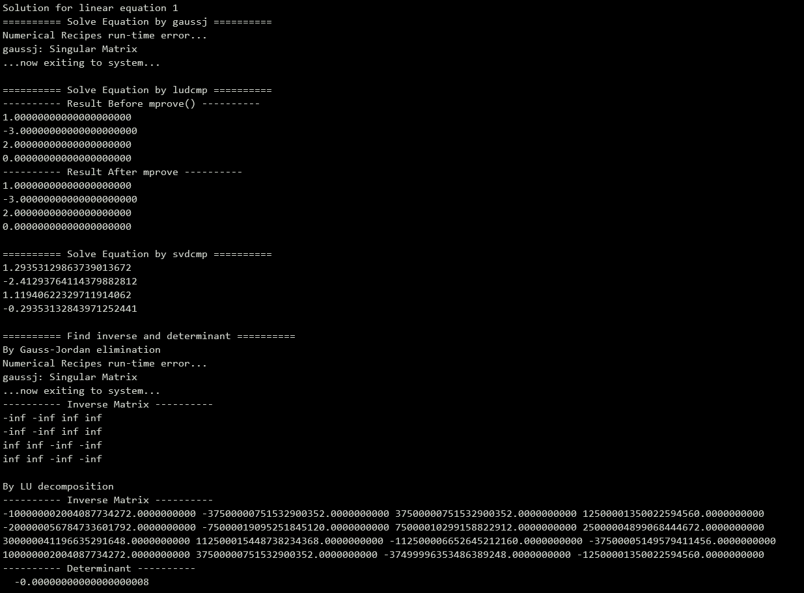
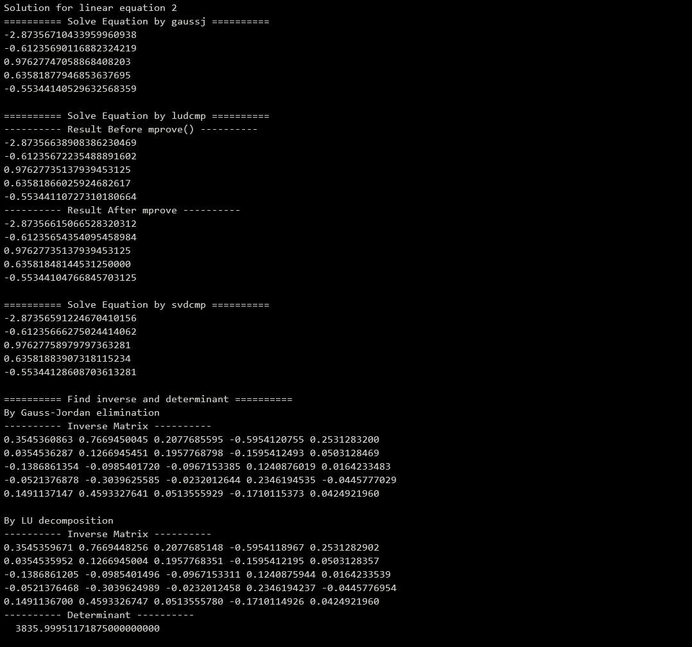
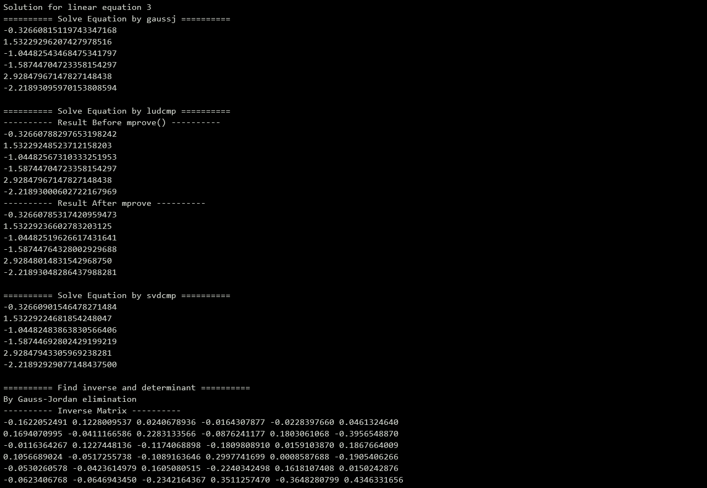
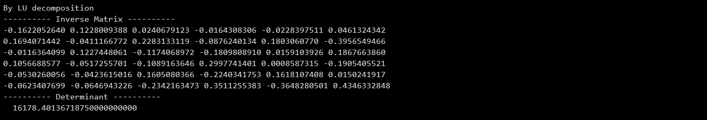

# HW5

## 환경

- OS: Ubuntu 18.04

  언어: C11

  gcc: 7.5.0

  


## 실행순서

```
1. visual studio 빈프로젝트 생성
2. 해당 파일들을 소스코드에 복사.
3. '프로젝트 속성 -> 디버깅 -> 작업 디렉토리'에 소스파일 및 data file path 설정
4. Data file은 하위 directory hw5_data에 넣기. 
5. ctrl+f5

3번 ex) D:\development\Ubuntu_env\Numerica_Analysis\2021_mat3008_2017029952\hw5
4번 ex) D:\development\Ubuntu_env\Numerica_Analysis\2021_mat3008_2017029952\hw5\hw5_data 에 .dat 파일 넣기
```

- 위의 방식이 정상적으로 동작하는 것을 확인했습니다.

  

## 공통사항

- 파일 별로 1, 2, 3번을 진행했습니다.
- 이미지 캡처로 표현한 해는 모두 n x 1 matrix입니다. 

## 문제 풀이

### File: lineq1.dat

- 결과 캡처

.


### File: lineq2.dat

.

### File: lineq3.dat

.

